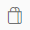

# Summary
This repository contains the resulting source code of the [Azure DevOps custom task extension](https://docs.microsoft.com/en-us/azure/devops/extend/develop/add-build-task?view=azure-devops). A few tweaks here and there have been made to make it a more robust base Azure DevOps task extension.

# Prerequisites
 - Install the latest [Node](https://nodejs.org/en/download/).
 - An [Azure DevOps publisher account](https://docs.microsoft.com/en-us/azure/devops/extend/publish/overview?view=azure-devops#create-a-publisher).
 - An [Azure DevOps PAT](https://docs.microsoft.com/en-us/azure/devops/organizations/accounts/use-personal-access-tokens-to-authenticate?view=azure-devops&tabs=preview-page). Make sure your PAT has "MarketPlace" scope enabled. Giving it access to All Scopes always works as well.

# Setup
In order to build and publish this task, you will need to do the following:
 - Open both of the [package.json](https://github.com/mastloui/Azure-DevOps-Sample-Task-Extension/blob/master/My-Sample-Task/package.json) and the [vss-extension.json](https://github.com/mastloui/Azure-DevOps-Sample-Task-Extension/blob/master/vss-extension.json) and replace the {{YOUR_PUBLISHER_NAME}} tokens with your publisher name.

That's it for the setup!

# How to Publish
 - Clone the sample [repository](https://github.com/mastloui/Azure-DevOps-Sample-Task-Extension)
 - Open a command window and navigate to the My-Sample-Task directory
 - run `npm run bootstrap`. This will install all of the necessary npm packages to build & publish the task.
 - run `npm run publish`. The command will ask for your PA - Paste it in!

> **Note:** You can add --token <YOUR_PAT> to the publish script in the package.json to make your life a bit easier!

# How to Install/Use
Once the task has been published and shared to your visual studio online account, do the following to install & use the task:
 - Log into your visual studio online account ({{ACOUNT_NAME}}.visualstudio.com)
 - Go on the upper right corner and click on  -> manage extensions
- Click on the **Shared** tab.
- Install your extension
- Go back to your visual studio online account.
- Create a new release definition by going to **Pipelines -> Releases**
- Add a new task and search for "My Sample Task" - You should see your newly published task!

# Reference Material
- [Azure DevOps custom task extension tutorial](https://docs.microsoft.com/en-us/azure/devops/extend/develop/add-build-task?view=azure-devops)
   - A little tutorial which explains at a high level how to create your own Azure DevOps task extension. Caveat is that no source code is provided.